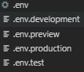
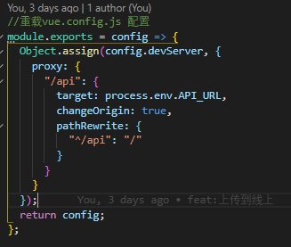

# 注意事项

### 环境变量

参考 /project/demo/config
可以覆盖环境变量, 默认使用了 4 套环境

```
development 开发
test 测试
preview 预发布
production 正式
```

在代码中使用

```
process.env.NODE_ENV

NODE_ENV
BASE_URL
```



如果只需要本机修改的时候可以添加对应的本地配置,不会影响其他人

比如 .env.development.local

### 静态文件

脚手架去掉了根目录的 public  
请在项目文件夹中新建 public 文件夹  
如果有个别项目需要共享部分文件可以添加一个全局配置,使用 copy-webpack-plugin 来依赖某个文件夹

### 路径别名

```
@
@src  当前项目地址 例如 "@src/assets/logo.png"
```

### 打包配置

参考 /project/demo/config
在 webpack.js 中可以覆盖 vue.config 中的配置



### 自定义配置

在环境变量中设置

```.env
#打包后自动生成压缩文件 默认关闭 1开启
DIST_ZIP=0
```
