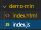
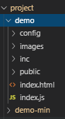
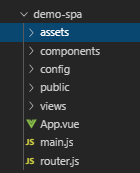

# 快速开始

## 创建一个项目

> 所有的项目都放在/project 文件夹,只需要新建目录就可以开始一个新项目  
> 项目里面已经提供了几个模板,复制一份就能马上开始

1. 最小约定  
   

 ```
   /project/demo-min
   最简单的一个多页面项目,只需要新建html和同名的js文件就可以
   如果要多个页面使用同一个js,在页面里面内联不同的js;可以只新建html文件,默认使用index.js
 ```
2. 多页面项目  
   

 ```
   /project/demo
   从demo-min扩展来的
   演示了项目各种配置的使用方法
 ```
3. 单页面项目  
  
   

 ```
/project/demo-spa
常规的单页面项目
 ```


## 运行命令

##### 查看文档
> yarn doc

##### 开发命令说明

(命令):(环境) (项目名称)

```
命令:serve 开发  build 编译
环境:dev 开发 test 测试 pre 预发布 pro 正式
项目名称: 项目文件夹名称,为空时默认为"demo"
```

假设项目名称是 leigod-pc  


##### 开发模式启动

> yarn serve:dev leigod-pc

##### 测试环境打包

> yarn build:test leigod-pc
