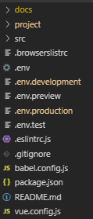

# 项目介绍

项目
cms模板 使用预渲染生成
内嵌使用预渲染支持部分SEO
个人中心
架构
同一个项目,不同域名共享静态资源
多个项目,共享架构和逻辑

部署的项目属于集成二次开发  

### 共享代码

1. 与产品无关的

   比如转盘,九宫格抽奖,地图,省市区等通用组件
   需要做成单独项目,支持按需加载
   可以引用不同的版本号

2. 业务类似的

master 分支,放指引
develop 基础代码
release/leigod-pc
release/leigod-box

hotfix/leigod-pc >>其他分支

架构

脚手架
项目

产品-项目

目前现状:leigod_vue
网站架构,耦合
体积
样式,代码改不动
繁琐
关联的库
更新发布,git提交,cdn
SEO
性能
不兼容ie11
开发
运行
维护
上线

解决方案:
按域名逐步替换
预渲染
cms

上线: 目前的增量更新

风险:

其他:
内部通用